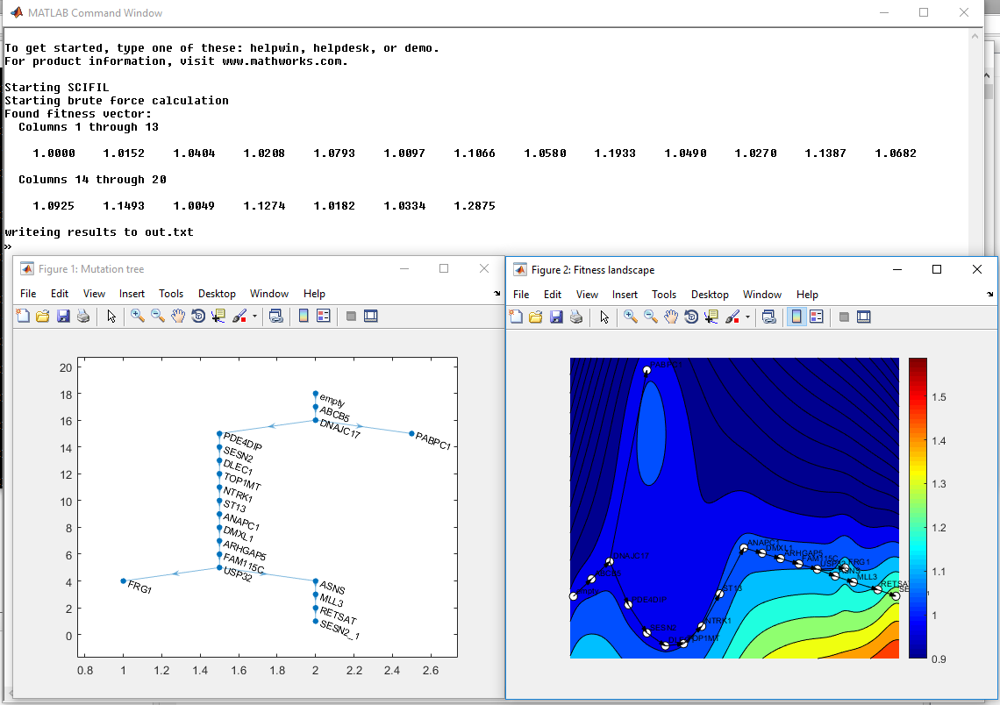

# SCIFIL
Single Cell Inference of FItness Landscape

We propose a computational method for in vivo inference of clonal
selection and estimate of fitness landscapes of heterogeneous cancer cell populations from
single cell sequencing data.

It takes single cell data, mutation tree and estimates finesses of all mutations.

## Parameters
- ``n`` - number of haplotypes
- ``m`` - number of mutation (not counting repeated mutation)
- ``gv_file``  - path to file with mutation tree in GraphcViz format
- ``names_file`` (_optional_) - name of file with mutation names
- ``output`` (_optional_) - path for output file. Default "out.txt"
- ``method`` (_optional_) - method to use for fitness calculation(default "heuristic"):
    - ``heuristic`` to use heuristic
    - ``brute_force`` to use brute force in finding order of mutation event in time for fitness estimation
- ``nRep`` (_optional_) - number of repeated mutation(if any) starting from 1
- ``theta`` (_optional_) - value of theta (mean cancer cells mutation rate). Default is 0.01.

## infSCITE trees
To obtain the trees from data folder we used infSCITE with following parameters:

``./infSCITE -i dataHou18.csv -n 18 -m 58 -r 1 -l 500000 -fd 3.45e-3 -ad 1.46e-1 -s -e .2 -p 10000 -d -rec 3 -o output/dataHou18/dataHou18 -a``
``./infSCITE -i dataHou18.csv -n 18 -m 58 -r 1 -l 500000 -fd 3.45e-3 -ad 1.46e-1 -s -e .2 -p 10000 -d -o output/dataHou18/dataHou18 -a``

With third (SESN2) repeated mutation and without it respectively.

## Hot to run

In console type and change to actual parameters:

``matlab -nodisplay -nodesktop -r "n=<number>;m=<number>;gv_file='<input_gv_tree>';output='<output_file>';method='<method_name>';nRep=<number>;theta=<number>;SCIFIL"``

Example:

``matlab -nodisplay -nodesktop -r "gv_file='data/dataHou18_map0_rep3.gv';names_file='data/dataHou18names.txt';nRep=3;n=58;m=18;SCIFIL"``

``matlab -nodisplay -nodesktop -r "gv_file='data/dataHou18_map0_noRep.gv';names_file='data/dataHou18names.txt';n=58;m=18;SCIFIL"``

Execution result:


There will be two figures. First represent mutation tree, second fitness landscape.


### Output file

Output contains only one line - calculated fitness of mutations in the same order as in names file or as their numbers in gv file (if names file is not specified). 
Repeated mutation's fitness will be the last one, first number is root(healthy tissue) fitness rate.

```
1.0000 1.0152 1.0404 1.0208 1.0793 1.0097 1.1066 1.0580 1.1933 1.0490 1.0270 1.1387 1.0682 1.0925 1.1493 1.0049 1.1274 1.0182 1.0334 1.2875 
```